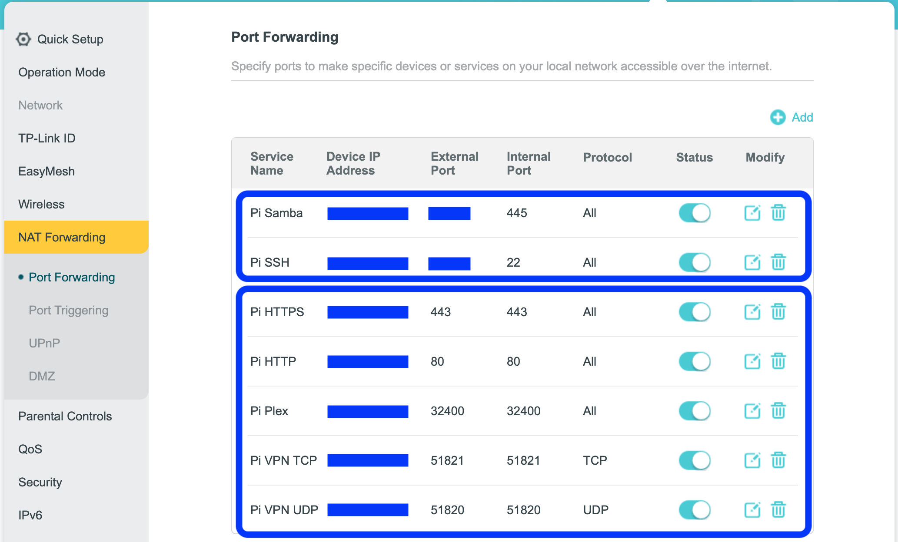

# Installation

This gude describe full installation process on Raspberry Pi 4B. Starting from scratch and having working Home server as result. This include follоwing steps:

- OS installation and boot from HDD (USB drive or SSD)
- Install Docker
- Prepare the router and sub domains
- Starting conternised media services package

## Raspberry Pi specifics - OS installation and boot from HDD (USB drive or SSD)
Install OS to SD card and HDD (as RPi boots by default from SD Card, we need to boot from SD card once to configure it to boot from HDD).

Download the latest Raspberry Pi Imager for your OS from [here](https://downloads.raspberrypi.org/imager/). 

- From **General purpose OS** section select 64 bit **Ubuntu server \<latest version\> (RPi Zero/2/3/4/400)**
- Select **SD card** as storage
- From advanced settings configure server name, user and network
- Start process

Once the process is finished, remove the SD card from the reader and insert it to RPi.

Do the same with HDD (USB Drive or SSD) and when ready, connect the USB drive to RPi.

Boot the RPi board.

Using the router configuration identify the IP address, and reserve it for the RPi for future usage:


Login to Server:

```
ssh <username>@<IP address>
```

Install **EPROM Tools**:

```
sudo apt install rpi-eeprom
```

Alternative approach is to download tools and install them manually:

```
wget http://archive.raspberrypi.org/debian/pool/main/r/raspi-config/raspi-config_20210604_all.deb 

sudo apt install ./raspi-config_20210604_all.deb
```

Then start the tools and adjust board configuration to boot from USB drive:

```
sudo raspi-config
```
- Select **Advanced Options**
- Select **Boot Order**
- Select **USB Boot** and confirm
- Shut down

When RPi is down remove the SD card, as it is not needed anymore. The board now boots from USB drive. 

## Install Docker

Login to Server and execute:

```
curl -fsSL https://get.docker.com -o get-docker.sh
sudo sh get-docker.sh
sudo usermod -aG docker $USER && newgrp docker
sudo apt-get install docker-compose-plugin
```

## Prepare the router and sub domains
The follwoing steps need to be done before start the stack:
- Ensure you have a static IP address assigned by your network provider, otherwise you may not be able to configure the DNS records.
- Adjust in Router ports 80 and 443 to be forwarded to the server IP address:

- Add to your domain configuration CNAME records for subdomains you want to expose from the stack - grafana, transmission, files, plex and calibre

## Starting conternised media services package

Login to Server and execute:

```
git clone https://github.com/dzahariev/home-server.git
```

Using text editor adjust the configuration by:
- Set the root host domain that should be used by the stack.
- Admin email, that will be used to issue server side certificates from Lets Encrypt.
- Set the path to Data directory - used for persisting the applicaiton specific configuration during stack updates.
- Set the path to Media direcotry - where all your media files will be stored and should be visible from Plex media server. 
- Set all usernames and credentials (use random values) in .env file.

Start the stack:

```
docker-compose --env-file .env up -d
```


## Links
- Ubuntu installation guide [here](https://ubuntu.com/tutorials/how-to-install-ubuntu-on-your-raspberry-pi).
- Boot from HDD guide [here](https://friendsoflittleyus.nl/boot-ubuntu-server-20-10-from-external-usb-ssd-on-raspberry-pi4/)
